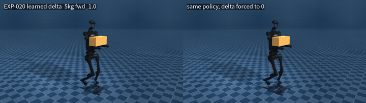
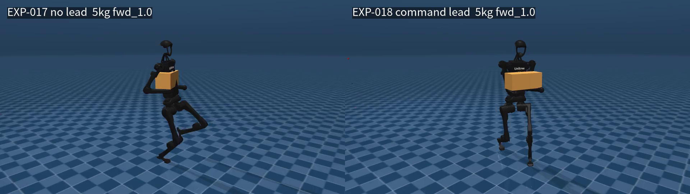
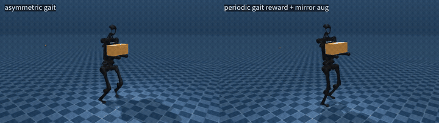
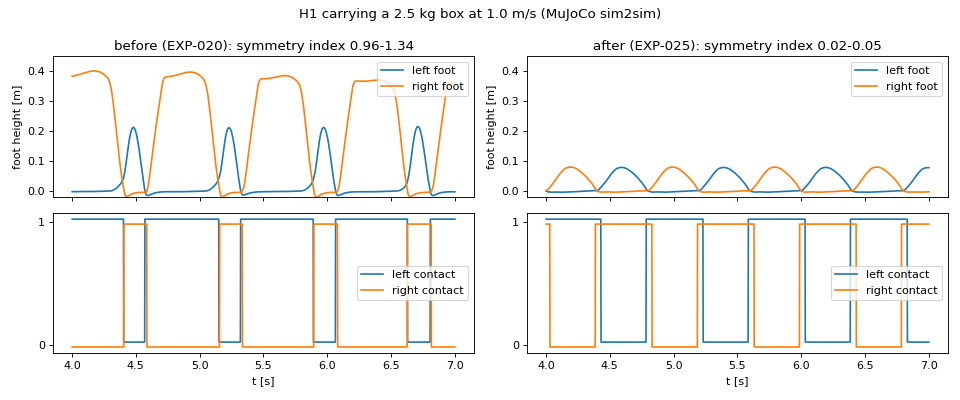

# H1 人形机器人托箱行走：RL 下肢 × QP 上肢的混合控制

Unitree H1 双臂托着箱子行走（0–5 kg）。下肢步态用强化学习训练（Isaac Lab / PPO），上肢由速度级加权 QP 控制，**QP 直接放在训练回路里**。训练好的策略部署到独立实现的 MuJoCo 控制栈（sim2sim）中验证。

> 全部结果来自仿真（Isaac Lab 训练，MuJoCo 部署验证），**没有真机实验**。每个实验只跑了一个 seed。



*左：策略学到的上身参考修正（Δ）；右：同一个策略，把 Δ 强制设为 0，箱子在约 3 s 时滑落。*

---

## 1. 我做了什么

| 模块 | 内容 |
|---|---|
| **上肢 QP**（C++ / Eigen / OSQP + torch 批量版） | 速度级加权 QP：每只手 3 维位置任务 + 1 维前臂俯仰任务（J_pitch = (a × e_z)ᵀ J_rot）；姿态正则、关节限位、速度约束；q_des 用积分方式得到，并做抗饱和限幅；负载重力前馈 τ_ff = g(q) + J_loadᵀ(0, 0, m/2·g) |
| **QP 进训练回路** | 写了 GPU 批量的积极集盒约束 QP 求解器，4096 个环境并行求解，100 Hz；逐项与 C++ 版本对齐 |
| **RL 下肢** | Isaac Lab manager-based 环境。非对称 actor-critic（critic 能拿到负载质量、上肢目标等特权信息）；负载上限课程（平均 episode 长度 > 90% 时加一档）；执行器限幅与部署端对齐 |
| **Sim2Sim 部署** | MuJoCo 部署链路与真机接口一致（Unitree 五元组：q, dq, kp, kd, τ）：50 Hz 策略 / 100 Hz QP / 500 Hz PD；航向闭环与训练端一致 |
| **真实接触箱子** | 箱子是自由刚体，只靠前臂摩擦托住，掉箱即 episode 终止；部署端有独立实现的箱体几何与滑移指标 |
| **混合方案** | 策略在 10 维腿部动作之外，再输出 2 维**上身参考修正**（双手内夹、上下），由 QP 精确执行；从上一版策略热启动（按维度映射权重） |
| **步态塑形** | 量化步态指标；周期步态奖励（时钟、着地时序、摆动高度）；左右镜像数据增强（按关节轴推导镜像映射，单元测试验证） |

## 2. 系统结构

```text
                       ┌──────────── 训练（Isaac Lab, 4096 envs）/ 部署（MuJoCo）共用同一套控制器 ────────────┐
 速度指令 ─┐            │                                                                               │
 本体感知 ─┼─> PPO 策略（50 Hz）──> 腿 10 维关节目标 ───────────────────────> 关节 PD（500 Hz）──> 机器人
 箱子位姿 ─┤
 步态时钟 ─┘        └──> 上身参考修正 Δ（2 维）─┐                                   ▲
                                              ▼                                   │
          跟随坐标系（基座低通 + 速度指令超前）──> 手部目标 ──> 加权 QP（100 Hz）──> 腰 + 双臂 q_des / dq_des / τ_ff
                                                           手位置 × 2 + 前臂俯仰 × 2，姿态正则，限位 / 速度约束，负载前馈
```

## 3. 主要结果

### 3.1 把真实控制器放进训练回路是必要的

| 训练时上肢怎么动 | MuJoCo 部署存活（9 个工况） | 手部误差 |
|---|---|---|
| QP 在训练回路中 | **9/9** | 8.8–45.3 mm |
| 随机扰动近似（部署时再接 QP） | 2/9 | 61–67 mm |

腿需要在训练中见过真实上身控制器的动力学。只用随机扰动去"模拟"上身，部署时两者对不上。

### 3.2 Sim2Sim 失效归因：执行器限幅契约

部署在 1.0 m/s 带负载时摔倒。用单变量实验定位到训练端踝力矩上限（100 N·m）与部署模型（40 N·m）不一致。把**训练端**对齐到部署端之后重训，存活从 **7/9 提升到 9/9**，踝饱和从 26–43% 降到 2–30%。

### 3.3 指标会骗人：跟踪误差小 ≠ 参考正确

行走时手部跟踪误差只有 7–18 mm，但加上箱体几何检查后，发现箱子穿进了躯干。原因是跟随坐标系用了基座位姿的一阶低通，匀速运动时会有 v·τ 的稳态滞后（实测 165 mm @0.53 m/s，理论值 168 mm）。

- 第一次修复用**实测**速度做补偿，形成正反馈：机器人越走越快，9 个工况摔了 4 个；
- 改成用**指令**速度做前馈超前（经过同一个低通）之后，手相对骨盆的前向偏差从 −151 至 −286 mm 降到 **−27 至 +12 mm**。



### 3.4 真实接触的箱子：纯分层失败，混合方案成功

| | 纯分层（腿 RL + 上身 QP） | 混合（RL 额外输出上身参考修正，QP 执行） |
|---|---|---|
| Isaac：掉箱占终止原因 / 负载课程 | 39% / 停在 1 kg | **6.4% / 升到 5 kg** |
| 步态 | 深蹲（骨盆 0.62 m） | 正常高度 |
| MuJoCo 自由箱子 μ = 0.75，托满 20 s | 0/9 | **9/9** |
| MuJoCo μ = 0.5 | 0/9 | 7/9 |

纯分层失败的原因：上身 QP 不知道箱子在哪；奖励里没有约束骨盆高度，策略就学会了蹲下来降低重心。

**部署端消融（同一个混合策略，只替换 Δ）：**

| Δ 的来源 | μ = 0.75 | μ = 0.5 |
|---|---|---|
| 学到的 Δ | **9/9** | **7/9** |
| 固定常数 (60, 30) mm | 5/9 | 2/9 |
| 强制为 0 | 2/9 | 1/9 |

局限：这个消融只在部署端做，腿处于训练分布之外；严格的消融需要重新训练。纯分层和混合方案之间一共有 7 项改动，差异不能全部归因于 Δ。

### 3.5 步态：从"跛行"到对称步态（问题 → 定位 → 修复 → 验证）



**问题（量化）**：托箱成功以后，机器人走得不协调。我先在部署评估中加入步态指标，再判断"丑"具体是什么：
- 左右脚支撑占比 0.76–0.86 / 0.17–0.27；
- 右脚摆动时抬到 36–48 cm；
- 双支撑只有 2–5%。

Isaac 与 MuJoCo 中一致，说明是训练学出来的，不是迁移造成的。

**定位**：默认的 `feet_air_time` 奖励每步给 min(支撑脚接触时长, 摆动脚腾空时长)，上限 0.6 s。对称步态每次单支撑只有约 0.35 s，拿不到上限；"一条腿长时间撑、另一条长时间悬空"反而得分更高。奖励里也没有任何对称约束。
- 只把上限改成 0.4 s、从旧策略继续训练（单变量 + 对照组）：几乎无效（对称指数 0.71–1.14 vs 0.96–1.26）。
- 教训：改奖励时从旧策略热启动，会困在旧步态里。

**修复**：参考 Humanoid-Gym 的周期步态奖励与 rsl-rl 的对称增强：
- 0.8 s 步态时钟作为观测；
- 着地时序奖励（左右交替 + 双支撑窗口）；
- 摆动脚高度跟踪（8 cm 正弦轨迹）；
- 去掉 `feet_air_time`；
- 左右镜像数据增强。镜像映射按关节轴推导：roll / yaw 取负，角速度按伪矢量变换，时钟相位平移半周期；单元测试保证"镜像两次 = 恒等"。

**验证**（从零训练 3000 轮，MuJoCo 部署，9 工况）：

| 指标 | 修复前 | 修复后 |
|---|---|---|
| 左右支撑对称指数（0 = 完全对称） | 0.96–1.34 | **0.02–0.05** |
| 摆动脚抬高 | 右脚 36–48 cm | **7.6–8.2 cm** |
| 双支撑占比 | 2–5% | **8–12%** |
| 能耗 CoT | 0.71–1.31 | **0.31–0.77** |
| 托箱 20 s，μ = 0.75 / 0.5 | 9/9 / 7/9 | **9/9 / 9/9** |



训练中踩过的坑：先从旧策略热启动加镜像增强，第 778 轮数值发散。推断原因是不对称的旧策略与镜像样本的概率比过于极端。从零训练则全程稳定（symmetry loss ≈ 0.005）。
代价：步频被时钟固定在 2.5 Hz；转弯角速度只跟到 0.23–0.31 rad/s（指令 0.5）；0.5 m/s 指令下实际 0.39–0.45 m/s。

## 4. 一致性验证（训练端与部署端是"同一个控制器"）

| 检查项 | 结果 |
|---|---|
| 前臂俯仰 Jacobian 有限差分 | 误差 2.6e-10 / 4.8e-10 |
| GPU 批量 QP 求解器 vs OSQP | 2.4e-4 |
| torch 版 vs C++ 版前馈力矩 | 1.3e-15 |
| Isaac vs MuJoCo 上肢运动学 | ≤ 7e-7 |
| 吊挂 + 骨盆振荡下手部误差 | 关节固定 22.1 → QP 12.6 → QP + 前馈 **6.1 mm** |

排查过的契约不一致（都有记录和修复）：关节顺序（广度优先 vs 深度优先）、Jacobian 基座列约定（世界系 vs 本体系角速度）、偏置力口径（纯重力 vs 含科氏力）、执行器力矩上限、评估指令生成方式（开环 wz vs 航向闭环）、碰撞体资产（最小碰撞集下箱子会直接穿过手臂）。

## 5. 目录

```text
src/humanoid_wbc/            C++（ament_cmake）
  include/, src/             上肢 QP（upper_body_qp）、MuJoCo 运动学、OSQP 封装、力矩级 WBC（前一阶段的工作）
  src/upper_body_qp_test.cpp       吊挂 + 锚点振荡测试台
  src/upper_body_jacobian_check.cpp  有限差分校验
  model/unitree_h1/          H1 MJCF 与网格
rl/
  h1_locomanip/              torch 批量 QP、积极集求解器、Isaac↔MuJoCo 运动学适配
  h1_locomanip/tasks/        Isaac Lab 环境：上肢 QP action term、MDP 项（课程 / 奖励 / 终止 / 步态）、左右镜像映射、v2–v5 配置
  scripts/                   sim2sim 部署评估、契约导出、冒烟测试、热启动
  tests/                     torch vs C++ 一致性、课程离线测试、镜像映射检查
  contract/                  训练端 → 部署端契约（关节顺序、增益、限幅、QP 参数）
media/                       README 用图
```

## 6. 运行

```bash
# C++ 上肢 QP 与测试台（ROS 2 / colcon，依赖 MuJoCo、Eigen、OSQP）
colcon build --packages-select humanoid_wbc
./build/humanoid_wbc/upper_body_jacobian_check
./build/humanoid_wbc/upper_body_qp_test --mode qp --osc 1 --pose carry15 --payload 5   # 吊挂 + 骨盆振荡；--mode fixed 为关节固定对照

# 训练（Isaac Lab 6.x，rsl-rl 5.0）
isaaclab.sh train --rl_library rsl_rl --task H1-LocoManip-CarryBoxGait-v5 --seed 42 --max_iterations 3000 \
    --external_callback h1_locomanip.tasks.register env.curriculum.payload.params.enabled=true

# MuJoCo 部署评估（策略权重不在仓库中，需要自行训练导出）
python rl/scripts/sim2sim_carry.py --policy <exported/policy.pt> --contract rl/contract/carry_v5.json --out eval
```

硬件：RTX 4080 SUPER，4096 个并行环境。带上肢 QP、真实箱子与镜像增强时吞吐约 23–31k steps/s，3000 轮约 2.7 h。

## 7. 局限与下一步

- **全部在仿真中**，没有真机；每个实验只有一个 seed。
- 混合方案的 actor 使用了箱子位姿，真机上需要视觉或力觉估计。
- 混合策略在 0.5 m/s 时偏慢 10–20%，转弯角速度跟踪变差。
- 步态由固定周期时钟约束，步频不随速度变化；转弯跟踪偏弱。后续可做速度相关的步态周期，或者用真人动捕数据做风格先验（AMP）。
- 严格消融（重训一个 Δ 固定的策略）尚未完成。
